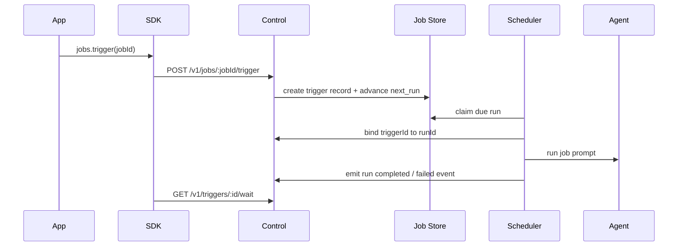

# Agent Runtime And SDK Control Plane

This document explains what the agent does and what the surrounding runtime does when an app uses `@myclaw/sdk`.

## Boundary

The agent is not the control plane.

The runtime owns:

- session lookup
- message persistence
- queueing
- scheduler/job claiming
- webhook delivery
- event storage
- auth and scopes

The agent owns:

- interpreting the prompt
- producing replies
- using runtime-exposed tools
- emitting structured output through normal runtime channels

ACP/ACPS are harness/runtime integration concerns. They are not part of the agent contract.

## Message lifecycle

1. A backend app calls `sessions.ensure()`.
2. The control server maps `(appId, conversationId)` to an `app:` JID and runtime group folder.
3. The app calls `sessions.sendMessage()`.
4. The runtime stores the inbound message in Postgres.
5. The runtime enqueues the group for normal processing.
6. The agent runs through the existing host-managed execution path.
7. Outbound replies are sent through the `app` channel adapter.
8. The adapter writes durable `control_events`.
9. Those events are visible through:
   - `sessions.wait()`
   - `sessions.stream()`
   - webhook delivery

## Job lifecycle

## Why the `app` channel exists

The `app` channel keeps app-originated conversations on the same runtime path as Slack and Telegram:

- same queue semantics
- same session model
- same agent runner
- same output delivery behavior

That avoids a second agent-output path with different behavior.

## Provider And Conversation Onboarding Control Surface

The control API exposes provider and conversation onboarding through
application-layer services:

- provider catalog and provider connection records
- provider discovery into canonical `Conversation` records
- `AgentConversationBinding` enable/update/disable for a conversation
- conversation, thread, and message reads for Web UI and SDK clients

Installation payloads store non-secret provider config and runtime secret
references only. Raw provider tokens stay behind `RuntimeSecretProvider`.
Disabling a binding marks it `disabled` so UI and CLI clients can re-enable it
without losing the binding policy, trigger, memory, or permission settings.
