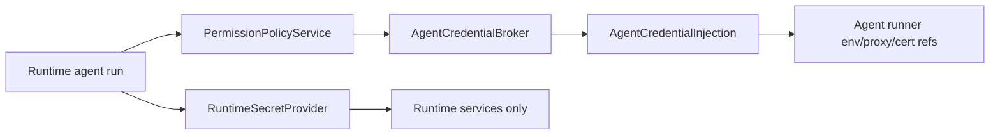

# Credential Management

MyClaw separates runtime-owned secrets from credentials that agents may access
through a broker.

## Runtime-Owned Secrets

Runtime-owned secrets are needed to start and operate MyClaw or its connected
services. They are read through `RuntimeSecretProvider`.

Examples:

- `MYCLAW_DATABASE_URL`
- `SLACK_BOT_TOKEN`
- `SLACK_APP_TOKEN`
- `TELEGRAM_BOT_TOKEN`
- webhook secret
- control API secret
- `ONECLI_DATABASE_URL`
- `SECRET_ENCRYPTION_KEY`

Runtime-owned secrets are never injected into an agent runner. They are checked
by runtime preflight, doctor, channel setup, storage readiness, and broker
persistence readiness.

## Agent-Accessed Credentials

Agent-accessed credentials are credentials an agent may use after policy allows
the action. They include LLM provider access and tool or API credentials.

Agents do not receive raw secret values from MyClaw. Runtime code requests an
`AgentCredentialInjection` from `AgentCredentialBroker`; the returned injection
contains only broker-safe environment values, proxy references, and certificate
references.

## Broker Profiles

`MYCLAW_CREDENTIAL_MODE` supports:

- `onecli`: local/personal default using the OneCLI adapter.
- `none`: development mode with no broker injection.
- `external`: future enterprise-managed credentials.

The `external` profile is a placeholder contract. It does not include a Vault,
Kubernetes, AWS, GCP, Azure, or custom implementation yet.

## OneCLI Adapter

OneCLI remains supported as the default personal broker. Its implementation
lives under `apps/core/src/adapters/credentials/onecli/`.

The adapter owns:

- `@onecli-sh/sdk` usage
- OneCLI URL validation
- broker-safe environment filtering
- OneCLI CA certificate materialization for host runners
- local OneCLI persistence readiness checks

The runtime calls the application credential service and receives a generic
`AgentCredentialInjection`; it does not instantiate OneCLI.

## Permission Boundary

Credential injection is not permission approval. Agent actions must still pass
through `PermissionPolicyService` before credentials are injected or used for a
tool/API action.

